# SIU AI API — End-User Guide

**Gateway:** `https://api.cs.siu.edu`  
**Hosted model:** SIU's Qwen 3.8 27B deployment  
**API style:** OpenAI compatible through LiteLLM  
**Guide version:** 2026-08-21

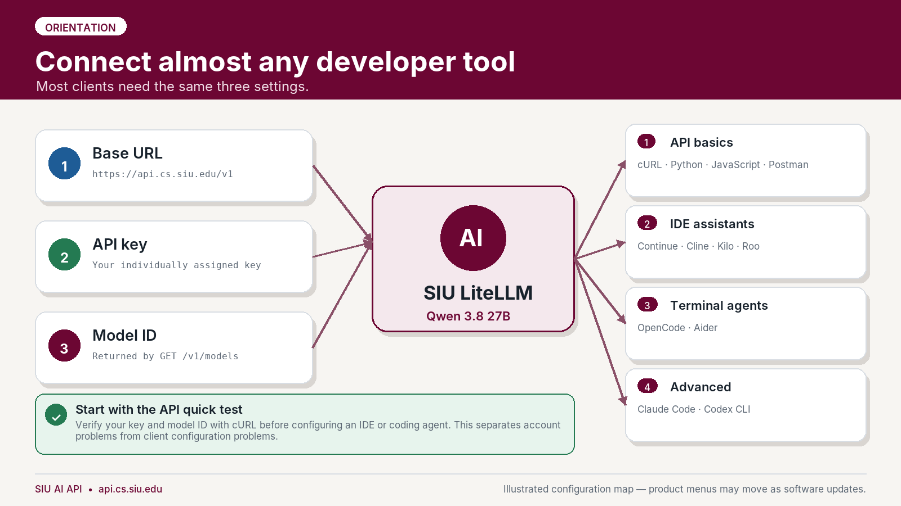

The SIU Computer Science AI API can be used from ordinary programs, REST clients, IDE assistants, and coding agents. Most integrations require only three values:

| Setting | Value |
|---|---|
| OpenAI-compatible base URL | `https://api.cs.siu.edu/v1` |
| API key | Your individually assigned SIU AI key |
| Model ID | The exact Qwen model ID returned by `GET /v1/models` |

> **Do not guess the model ID.** The model's display name is Qwen 3.8 27B, but the public LiteLLM alias may be different. Run the model-discovery request first and copy the exact `id` value.

> **Protect your key.** Treat it like a password. Do not put it in source code, screenshots, assignments, public repositories, shared configuration files, or browser-side JavaScript.

## Contents

1. [Choose the right client](#1-choose-the-right-client)
2. [Get ready and discover the model](#2-get-ready-and-discover-the-model)
3. [cURL](#3-curl)
4. [Python OpenAI SDK](#4-python-openai-sdk)
5. [JavaScript / TypeScript OpenAI SDK](#5-javascript--typescript-openai-sdk)
6. [Continue for VS Code or JetBrains](#6-continue-for-vs-code-or-jetbrains)
7. [Cline for VS Code](#7-cline-for-vs-code)
8. [OpenCode](#8-opencode)
9. [Aider](#9-aider)
10. [Postman](#10-postman)
11. [LangChain and LangGraph](#11-langchain-and-langgraph)
12. [Claude Code through LiteLLM](#12-claude-code-through-litellm-advanced)
13. [Codex CLI](#13-codex-cli-advanced)
14. [Kilo Code](#14-kilo-code)
15. [Roo Code](#15-roo-code)
16. [Troubleshooting](#16-troubleshooting)
17. [Security and responsible use](#17-security-and-responsible-use)
18. [Included files](#18-included-files)

---

<a id="1-choose-the-right-client"></a>

## 1. Choose the right client

| Client | Good choice for | API route | Recommendation |
|---|---|---|---|
| cURL | First test and troubleshooting | `/v1/models`, `/v1/chat/completions` | Start here |
| Python OpenAI SDK | Python assignments and services | `/v1/chat/completions` | Recommended |
| JavaScript OpenAI SDK | Node.js and TypeScript applications | `/v1/chat/completions` | Recommended |
| Continue | IDE chat, code edits, and optional agent mode | `/v1/chat/completions` | Recommended; validate tools before agent mode |
| Cline | Agentic development in VS Code | `/v1/chat/completions` | Recommended with command approval on |
| OpenCode | Terminal coding agent | `/v1/chat/completions` | Recommended |
| Aider | Git-oriented terminal coding | `/v1/chat/completions` | Recommended |
| Postman | Visual REST testing and instruction | `/v1/models`, `/v1/chat/completions` | Recommended |
| LangChain / LangGraph | AI application development | `/v1/chat/completions` | Recommended |
| Kilo Code | VS Code coding assistant | `/v1/models`, `/v1/chat/completions` | Recommended; validate tools |
| Roo Code | VS Code coding agent with a LiteLLM provider | `/v1/model/info`, chat routes | Recommended; use fallback if discovery is disabled |
| Claude Code | Claude Code interface routed to Qwen | `/v1/messages` | Advanced and compatibility-dependent |
| Codex CLI | Codex interface routed to Qwen | `/v1/responses` | Advanced; publish only after endpoint validation |

**A practical starting set for students:** cURL, Python, JavaScript, Continue, Cline, OpenCode, Aider, and Postman. Claude Code and Codex should remain in an advanced section because they use different wire protocols and may not reproduce all native vendor behavior when backed by Qwen.

---

<a id="2-get-ready-and-discover-the-model"></a>

## 2. Get ready and discover the model

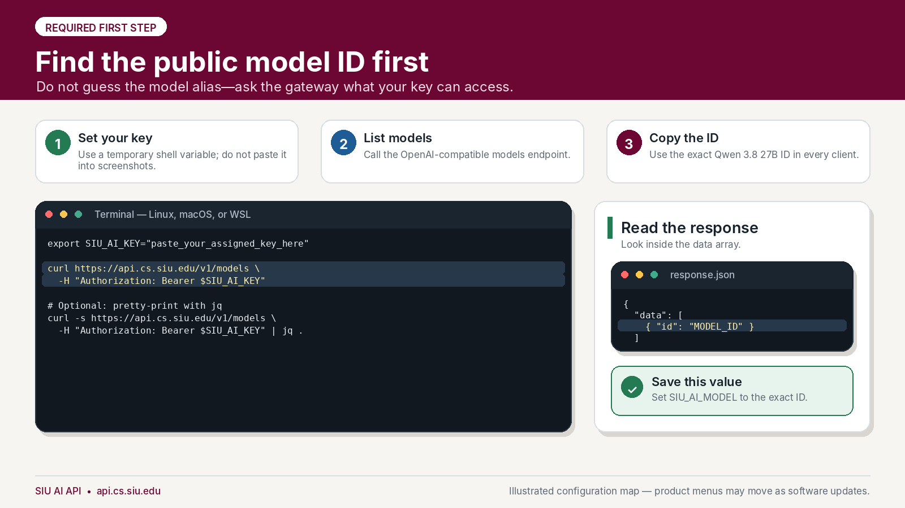

### 2.1 Obtain an API key

Use the key issued to you by the department. Keys may have individual model access, rate limits, concurrency limits, and budgets. Do not use another person's key.

### 2.2 Set temporary environment variables

#### Linux, macOS, or WSL

```bash
export SIU_AI_BASE_URL="https://api.cs.siu.edu/v1"
export SIU_AI_KEY="paste_your_assigned_key_here"
```

#### Windows PowerShell

```powershell
$env:SIU_AI_BASE_URL = "https://api.cs.siu.edu/v1"
$env:SIU_AI_KEY = "paste_your_assigned_key_here"
```

These values last for the current terminal session. That is usually safer than permanently storing a key in shell startup files.

### 2.3 List the models your key can use

#### Linux, macOS, or WSL

```bash
curl --fail-with-body --silent --show-error \
  "$SIU_AI_BASE_URL/models" \
  -H "Authorization: Bearer $SIU_AI_KEY"
```

With `jq` installed:

```bash
curl -s "$SIU_AI_BASE_URL/models" \
  -H "Authorization: Bearer $SIU_AI_KEY" \
  | jq -r '.data[].id'
```

#### Windows PowerShell

```powershell
$headers = @{ Authorization = "Bearer $env:SIU_AI_KEY" }
$response = Invoke-RestMethod `
  -Uri "$env:SIU_AI_BASE_URL/models" `
  -Headers $headers `
  -Method Get

$response.data.id
```

Copy the exact ID corresponding to the SIU Qwen 3.8 27B deployment, then set it:

```bash
export SIU_AI_MODEL="the_exact_id_returned_by_v1_models"
```

```powershell
$env:SIU_AI_MODEL = "the_exact_id_returned_by_v1_models"
```

A ready-made discovery script is included at [`examples/curl/list-models.sh`](examples/curl/list-models.sh).

---

<a id="3-curl"></a>

## 3. cURL

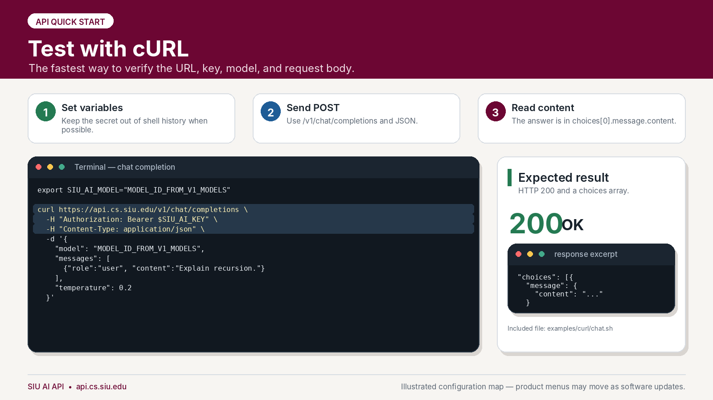

Use cURL before configuring another application. A successful request confirms that the network path, TLS connection, API key, model access, and basic LiteLLM route all work.

### 3.1 Send a chat-completion request

The included script safely constructs the JSON from environment variables:

```bash
cd examples/curl
./chat.sh
```

The equivalent request is:

```bash
curl --fail-with-body --silent --show-error \
  "$SIU_AI_BASE_URL/chat/completions" \
  -H "Authorization: Bearer $SIU_AI_KEY" \
  -H "Content-Type: application/json" \
  --data "$(cat <<JSON
{
  "model": "$SIU_AI_MODEL",
  "messages": [
    {
      "role": "system",
      "content": "You are a concise and careful programming assistant."
    },
    {
      "role": "user",
      "content": "Write a Python function that checks whether a string is a palindrome."
    }
  ],
  "temperature": 0.2,
  "stream": false
}
JSON
)"
```

A successful response normally contains:

```json
{
  "choices": [
    {
      "message": {
        "role": "assistant",
        "content": "..."
      }
    }
  ]
}
```

### 3.2 PowerShell request

```powershell
$headers = @{
  Authorization = "Bearer $env:SIU_AI_KEY"
  "Content-Type" = "application/json"
}

$body = @{
  model = $env:SIU_AI_MODEL
  messages = @(
    @{
      role = "user"
      content = "Explain recursion using a small Python example."
    }
  )
  temperature = 0.2
  stream = $false
} | ConvertTo-Json -Depth 5

$response = Invoke-RestMethod `
  -Uri "$env:SIU_AI_BASE_URL/chat/completions" `
  -Headers $headers `
  -Method Post `
  -Body $body

$response.choices[0].message.content
```

---

<a id="4-python-openai-sdk"></a>

## 4. Python OpenAI SDK

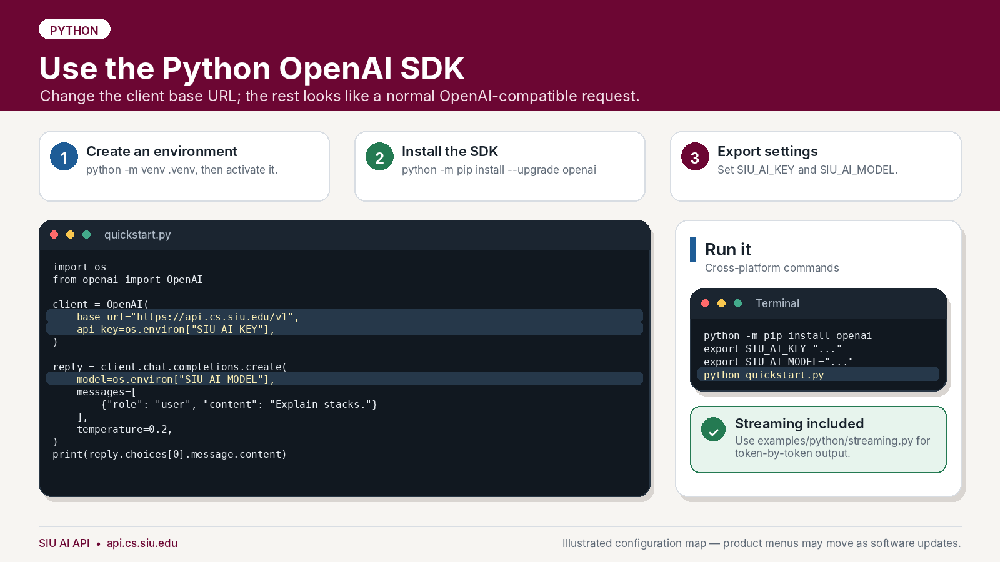

LiteLLM accepts OpenAI-compatible requests, so Python applications can use the standard `OpenAI` client with a custom `base_url`.

### 4.1 Create an environment and install the SDK

#### Linux, macOS, or WSL

```bash
cd examples/python
python3 -m venv .venv
source .venv/bin/activate
python -m pip install --upgrade pip
python -m pip install -r requirements.txt
```

#### Windows PowerShell

```powershell
cd examples\python
py -m venv .venv
.\.venv\Scripts\Activate.ps1
python -m pip install --upgrade pip
python -m pip install -r requirements.txt
```

### 4.2 Run the included example

Make sure `SIU_AI_KEY` and `SIU_AI_MODEL` are set, then run:

```bash
python quickstart.py
```

The essential code is:

```python
import os
from openai import OpenAI

client = OpenAI(
    base_url="https://api.cs.siu.edu/v1",
    api_key=os.environ["SIU_AI_KEY"],
)

response = client.chat.completions.create(
    model=os.environ["SIU_AI_MODEL"],
    messages=[
        {
            "role": "user",
            "content": "Explain Python list comprehensions with one short example.",
        }
    ],
    temperature=0.2,
)

print(response.choices[0].message.content)
```

### 4.3 Stream output as it is generated

```bash
python streaming.py
```

The complete examples include timeouts, retries, and basic error handling:

- [`examples/python/quickstart.py`](examples/python/quickstart.py)
- [`examples/python/streaming.py`](examples/python/streaming.py)

---

<a id="5-javascript--typescript-openai-sdk"></a>

## 5. JavaScript / TypeScript OpenAI SDK

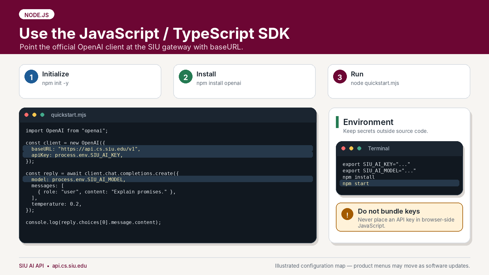

Use this approach for Node.js, server-side TypeScript, Electron, and other trusted runtimes.

> **Never place an API key in browser-delivered JavaScript.** A key embedded in React, Vue, Angular, or ordinary browser code can be extracted by anyone who loads the application. Put the API call in a trusted server-side component.

### 5.1 Install and run

This example requires **Node.js 22 or newer**. Check the active version before installing dependencies:

```bash
cd examples/javascript
node --version
npm install
npm start
```

The version should begin with `v22` or a higher number. If it is older, upgrade Node.js using your system administrator's approved method, open a new terminal, and run the commands again. A Python virtual environment such as `(.venv)` does not install or change Node.js.

For streaming output:

```bash
npm run stream
```

The essential code is:

```javascript
import OpenAI from "openai";

const client = new OpenAI({
  baseURL: "https://api.cs.siu.edu/v1",
  apiKey: process.env.SIU_AI_KEY,
});

const response = await client.chat.completions.create({
  model: process.env.SIU_AI_MODEL,
  messages: [
    {
      role: "user",
      content: "Explain async/await in JavaScript with one small example.",
    },
  ],
  temperature: 0.2,
});

console.log(response.choices[0].message.content);
```

Included files:

- [`examples/javascript/quickstart.mjs`](examples/javascript/quickstart.mjs)
- [`examples/javascript/streaming.mjs`](examples/javascript/streaming.mjs)
- [`examples/javascript/package.json`](examples/javascript/package.json)

---

<a id="6-continue-for-vs-code-or-jetbrains"></a>

## 6. Continue for VS Code or JetBrains

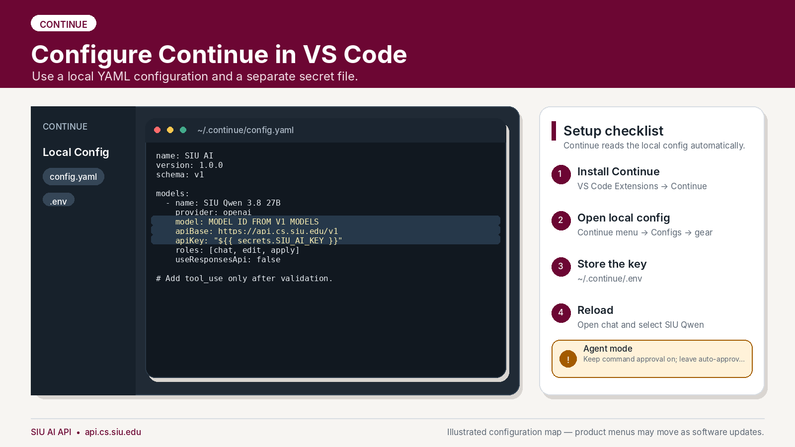

Continue is a good default IDE guide because it supports chat, code editing, and optional agent capabilities while using an OpenAI-compatible provider.

### 6.1 Install Continue

Install **Continue** from the extension or plugin marketplace for your IDE. Open Continue, select the configuration menu, and open the local configuration.

Common local paths:

- Linux and macOS: `~/.continue/config.yaml`
- Windows: `%USERPROFILE%\.continue\config.yaml`
- Secret file: `~/.continue/.env` or `%USERPROFILE%\.continue\.env`

### 6.2 Copy the supplied configuration

Copy [`examples/continue/config.yaml`](examples/continue/config.yaml) to the local Continue configuration path. Replace:

```yaml
model: replace_with_model_id_from_v1_models
```

with the exact ID returned by `GET /v1/models`.

The relevant configuration is:

```yaml
name: SIU AI
version: 1.0.0
schema: v1

models:
  - name: SIU Qwen 3.8 27B
    provider: openai
    model: replace_with_model_id_from_v1_models
    apiBase: https://api.cs.siu.edu/v1
    apiKey: "${{ secrets.SIU_AI_KEY }}"
    roles:
      - chat
      - edit
      - apply
    useResponsesApi: false
```

### 6.3 Store the key separately

Copy [`examples/continue/.env.example`](examples/continue/.env.example) to `~/.continue/.env`, rename it to `.env`, and replace the placeholder:

```dotenv
SIU_AI_KEY=your_assigned_key
```

Reload the IDE, open Continue, and select **SIU Qwen 3.8 27B**.

### 6.4 Agent mode

Start with ordinary chat and edit requests. Only add the following capability after the department confirms native tool calling works with the deployed model and client version:

```yaml
capabilities:
  - tool_use
```

Keep command approval enabled. Do not enable unrestricted automatic approval on coursework, research code, credentials, or important repositories.

---

<a id="7-cline-for-vs-code"></a>

## 7. Cline for VS Code

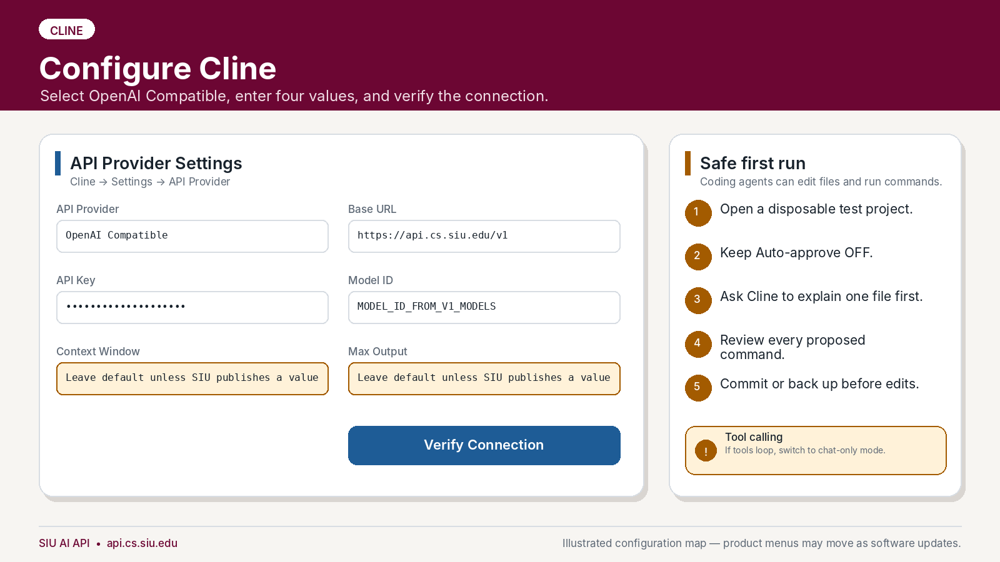

### 7.1 Enter the provider settings

Open Cline, select the settings gear, and configure:

| Field | Value |
|---|---|
| API Provider | **OpenAI Compatible** |
| Base URL | `https://api.cs.siu.edu/v1` |
| API Key | Your assigned SIU AI key |
| Model ID | Exact ID returned by `GET /v1/models` |
| Context Window | `32768` |
| Max Output Tokens | `4096` |

Select **Verify** or **Verify Connection**.

### 7.2 Perform a safe first test

1. Open a small disposable or already-committed project.
2. Keep **Auto-approve** off.
3. Ask Cline to explain one file without changing it.
4. Request one small edit.
5. Review the proposed diff and every command before approval.

If chat works but tool calls repeat, appear as plain text, or fail to execute, switch to chat-only behavior and report the issue with the client version and a redacted transcript.

---

<a id="8-opencode"></a>

## 8. OpenCode

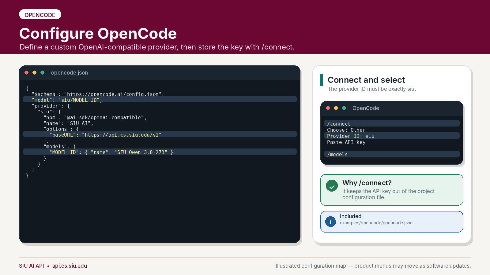

OpenCode can use a custom provider backed by `@ai-sdk/openai-compatible`.

### 8.1 Create the provider configuration

Copy [`examples/opencode/opencode.json`](examples/opencode/opencode.json) into the project directory as `opencode.json`. A global configuration can instead be placed in OpenCode's documented user configuration location.

Replace both occurrences of `replace_with_model_id_from_v1_models` with the exact model ID.

```json
{
  "$schema": "https://opencode.ai/config.json",
  "model": "siu/replace_with_model_id_from_v1_models",
  "provider": {
    "siu": {
      "npm": "@ai-sdk/openai-compatible",
      "name": "SIU AI",
      "options": {
        "baseURL": "https://api.cs.siu.edu/v1"
      },
      "models": {
        "replace_with_model_id_from_v1_models": {
          "name": "SIU Qwen 3.8 27B",
          "limit": {
            "context": 32768,
            "output": 4096
          }
        }
      }
    }
  }
}
```

The `limit.context` value tells OpenCode that the model has a 32,768-token total context window. The `limit.output` value reserves up to 4,096 tokens for a response, so OpenCode compacts conversation history before all 32,768 tokens are used. These settings do not increase the API server's capacity; they must not exceed the limits configured on the SIU gateway.

### 8.2 Store the credential with OpenCode

Launch OpenCode and run:

```text
/connect
```

Then:

1. Choose **Other**.
2. Enter the provider ID `siu` exactly as written in the configuration.
3. Paste the assigned API key.
4. Run `/models`.
5. Select `siu/<your-model-id>`.

Using `/connect` keeps the real key out of the project configuration.

---

<a id="9-aider"></a>

## 9. Aider

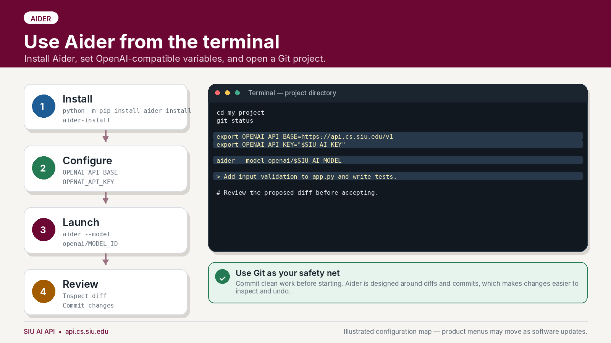

Aider is especially useful for students working from terminals, SSH sessions, Linux servers, or Git-oriented projects.

### 9.1 Install Aider

```bash
python -m pip install aider-install
aider-install
```

### 9.2 Set the endpoint and key

#### Linux, macOS, or WSL

```bash
export OPENAI_API_BASE="https://api.cs.siu.edu/v1"
export OPENAI_API_KEY="$SIU_AI_KEY"
```

#### Windows PowerShell

```powershell
$env:OPENAI_API_BASE = "https://api.cs.siu.edu/v1"
$env:OPENAI_API_KEY = $env:SIU_AI_KEY
```

### 9.3 Launch Aider in a Git project

```bash
cd my-project
git status
aider --model "openai/$SIU_AI_MODEL"
```

Aider may warn that it does not recognize metadata for a custom model name. Copy the included `.aider.model.metadata.json` into the project root and replace its model placeholder with the exact fully qualified name used at launch, such as `openai/Qwen3.8-27B`. The template declares a 32,768-token context window and 4,096-token output limit. Aider uses this metadata for reporting; the SIU gateway still enforces the actual limits.

Included templates:

- [`examples/aider/.env.example`](examples/aider/.env.example)
- [`examples/aider/.aider.conf.yml`](examples/aider/.aider.conf.yml)
- [`examples/aider/.aider.model.metadata.json`](examples/aider/.aider.model.metadata.json)

The key intentionally does not appear in `.aider.conf.yml`.

---

<a id="10-postman"></a>

## 10. Postman

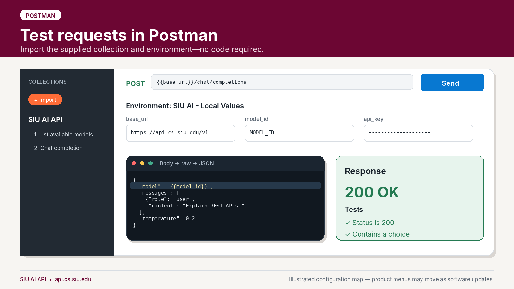

Postman is useful for learning REST APIs and testing requests without writing a program.

### 10.1 Import the supplied files

In Postman:

1. Select **Import**.
2. Import [`examples/postman/SIU_AI_API.postman_collection.json`](examples/postman/SIU_AI_API.postman_collection.json).
3. Import [`examples/postman/SIU_AI_Local.postman_environment.json`](examples/postman/SIU_AI_Local.postman_environment.json).
4. Select the **SIU AI - Local Values** environment.

### 10.2 Set local values

Set these environment variables:

| Variable | Current value |
|---|---|
| `base_url` | `https://api.cs.siu.edu/v1` |
| `api_key` | Your assigned key; mark it secret where supported |
| `model_id` | Exact model ID from the first request |

Do not export or synchronize an environment after placing a real key in it unless the destination is approved. Prefer Postman's local secret or vault features when available.

### 10.3 Run the collection

1. Send **1 - List available models**.
2. Copy the Qwen model's `id` into `model_id`.
3. Send **2 - Chat completion**.
4. Confirm `200 OK` and the two included tests pass.

You can also import any cURL example from this guide directly through Postman's import dialog.

---

<a id="11-langchain-and-langgraph"></a>

## 11. LangChain and LangGraph

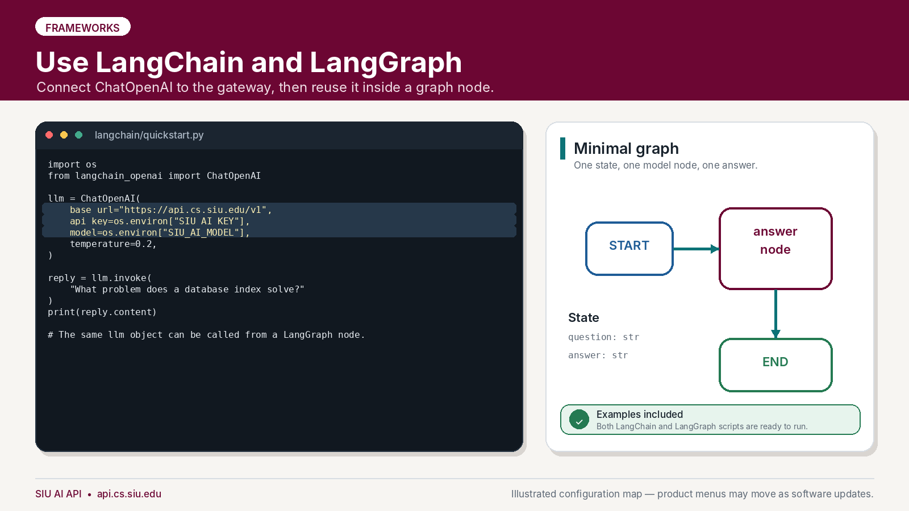

LangChain's `ChatOpenAI` integration accepts a custom OpenAI-compatible `base_url`.

### 11.1 Install the packages

LangChain 1.x and LangGraph 1.x require Python 3.10 or newer. Python 3.12 is recommended for a new environment. Confirm the interpreter version before creating the virtual environment.

#### Linux, macOS, or WSL

```bash
cd examples/langchain
python3.12 --version
python3.12 -m venv .venv
source .venv/bin/activate
python -m pip install --upgrade pip
python -m pip install -r requirements.txt
```

#### Windows PowerShell

```powershell
cd examples\langchain
py -3.12 --version
py -3.12 -m venv .venv
.\.venv\Scripts\Activate.ps1
python -m pip install --upgrade pip
python -m pip install -r requirements.txt
```

A virtual environment remains tied to the Python interpreter that created it. If an existing `.venv` reports Python 3.9 or older, create a new environment with Python 3.10 or newer instead of reusing it.

### 11.2 Run the LangChain example

```bash
python quickstart.py
```

Essential configuration:

```python
import os
from langchain_openai import ChatOpenAI

model = ChatOpenAI(
    base_url="https://api.cs.siu.edu/v1",
    api_key=os.environ["SIU_AI_KEY"],
    model=os.environ["SIU_AI_MODEL"],
    temperature=0.2,
)

response = model.invoke("What problem does a database index solve?")
print(response.content)
```

### 11.3 Run the minimal LangGraph

```bash
python langgraph_example.py
```

The example creates a simple graph:

```text
START → answer node → END
```

The same `ChatOpenAI` object is called from the `answer` node. Build this minimal version successfully before adding tools, persistence, retrieval, or multiple agents.

Included files:

- [`examples/langchain/quickstart.py`](examples/langchain/quickstart.py)
- [`examples/langchain/langgraph_example.py`](examples/langchain/langgraph_example.py)

---

<a id="12-claude-code-through-litellm-advanced"></a>

## 12. Claude Code through LiteLLM (advanced)

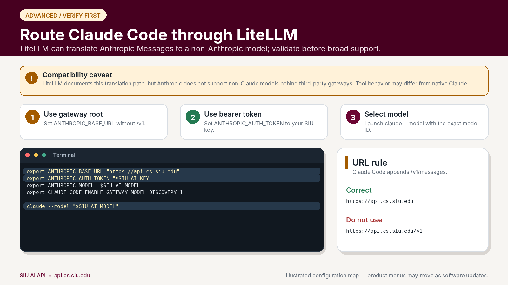

> **Compatibility warning:** This advanced integration translates Claude Code's Anthropic Messages traffic to Qwen through LiteLLM. Administrators must validate `/v1/messages`, streaming, and tool calls before publishing it. Reasoning streams require LiteLLM 1.96.0 or later.

### 12.1 Install Claude Code

Linux or WSL:

```bash
curl -fsSL https://claude.ai/install.sh | bash
claude --version
```

Windows PowerShell:

```powershell
irm https://claude.ai/install.ps1 | iex
claude --version
```

On native Windows, install Git for Windows so Claude Code's Bash tool is available. Reopen the terminal if `claude` is not recognized after installation.

### 12.2 Configure and launch

First set `SIU_AI_KEY` and `SIU_AI_MODEL` as described in [Section 2](#2-get-ready-and-discover-the-model). Then run the launcher from the guide's top-level directory.

Linux or WSL:

```bash
examples/claude-code/start-claude-code.sh
```

Windows PowerShell:

```powershell
& .\examples\claude-code\start-claude-code.ps1
```

The launchers validate the SIU variables, map every Claude model role to Qwen, and set a 32,768-token context, 4,096-token output limit, and `medium` reasoning effort. They keep the key in the process environment.

Do not run `/login`; restart through the launcher if Claude reports missing authentication. Validate the integration first in a disposable repository with a read-only file summary, then review the first edit manually.

### 12.3 Troubleshooting

| Error | Action |
|---|---|
| Tried to access `claude-opus-5` | Exit and relaunch with the included script. |
| Unsupported `reasoning_effort high` | Relaunch; the scripts set the supported value `medium`. |
| `Content block is not a thinking block` | Ask the administrator to upgrade LiteLLM to 1.96.0 or later. |
| `/login` prompt | Confirm the SIU key is set in the same terminal, then relaunch. |

---

<a id="13-codex-cli-advanced"></a>

## 13. Codex CLI (advanced)

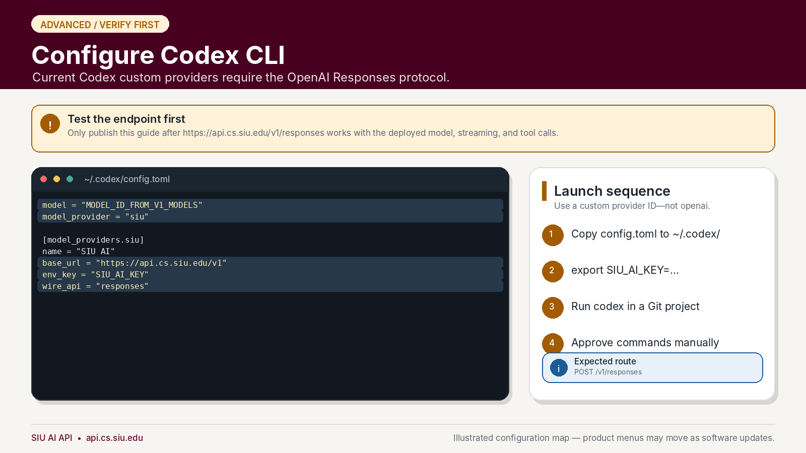

> **Compatibility requirement:** Current Codex custom model providers use the OpenAI Responses wire protocol. Do not advertise Codex support until the deployed LiteLLM version and backend pass end-to-end tests on `POST /v1/responses`, including streaming and tool calls.

### 13.1 Install Codex

Linux, macOS, or WSL:

```bash
curl -fsSL https://chatgpt.com/codex/install.sh | sh
codex --version
```

Windows PowerShell:

```powershell
powershell -ExecutionPolicy ByPass -c "irm https://chatgpt.com/codex/install.ps1 | iex"
codex --version
```

Alternatively, install it with npm on any platform that has Node.js:

```bash
npm install -g @openai/codex
codex --version
```

Reopen the terminal if `codex` is not recognized after installation. See the [official Codex CLI documentation](https://developers.openai.com/codex/cli/) for current installation options.

### 13.2 Test the route before configuring Codex

After the administrator confirms the feature is enabled, a minimal request resembles:

```bash
curl --fail-with-body \
  "https://api.cs.siu.edu/v1/responses" \
  -H "Authorization: Bearer $SIU_AI_KEY" \
  -H "Content-Type: application/json" \
  -d "{\"model\":\"$SIU_AI_MODEL\",\"input\":\"Reply with the word ready.\"}"
```

A working Chat Completions route does **not** prove that the Responses route works.

### 13.3 Configure a custom provider

Copy [`examples/codex/config.toml`](examples/codex/config.toml) to `~/.codex/config.toml` and replace the model placeholder:

```toml
model = "replace_with_model_id_from_v1_models"
model_provider = "siu"
model_context_window = 32768
model_auto_compact_token_limit = 28000

[model_providers.siu]
name = "SIU AI"
base_url = "https://api.cs.siu.edu/v1"
env_key = "SIU_AI_KEY"
wire_api = "responses"
```

The context settings tell Codex that the custom SIU model has a 32,768-token window and trigger compaction at 28,000 tokens, leaving room for a response of up to 4,096 tokens. Keep these settings at the top level. Use the custom provider ID `siu`; do not overwrite a reserved built-in provider name.

### 13.4 Launch

```bash
export SIU_AI_KEY="your_assigned_key"
codex
```

Start in a small Git repository, keep command approval enabled, and verify that requests reach the SIU gateway.

---

<a id="14-kilo-code"></a>

## 14. Kilo Code

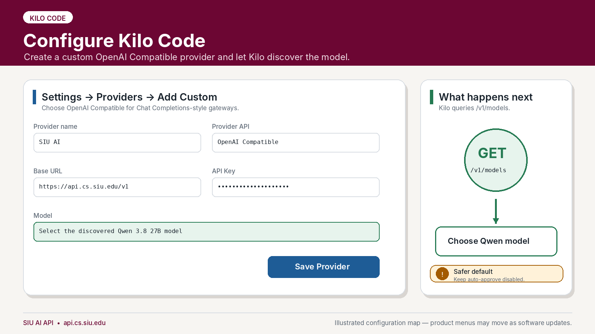

### 14.1 Add a custom provider

In Kilo Code:

1. Open **Settings**.
2. Open **Providers**.
3. Select **Add Custom**.
4. Enter a provider name such as `SIU AI`.
5. Select **OpenAI Compatible** as the provider API.
6. Set the Base URL to `https://api.cs.siu.edu/v1`.
7. Paste the assigned API key.
8. Select the discovered Qwen 3.8 27B model.
9. In the model configuration, set **Context Window** to `32768` and **Max Output Tokens** to `4096`.
10. Save the provider.

Kilo can query the provider's `/v1/models` endpoint after a valid Base URL and key are entered. If the token fields are not available in the settings screen, set the custom model's limits in `kilo.jsonc`:

```json
"limit": {
  "context": 32768,
  "output": 4096
}
```

These limits enable accurate context tracking and compaction for the custom SIU model. If discovery fails, verify the same key with the cURL model-list request before changing Kilo settings.

Keep automatic command approval disabled during initial use.

---

<a id="15-roo-code"></a>

## 15. Roo Code

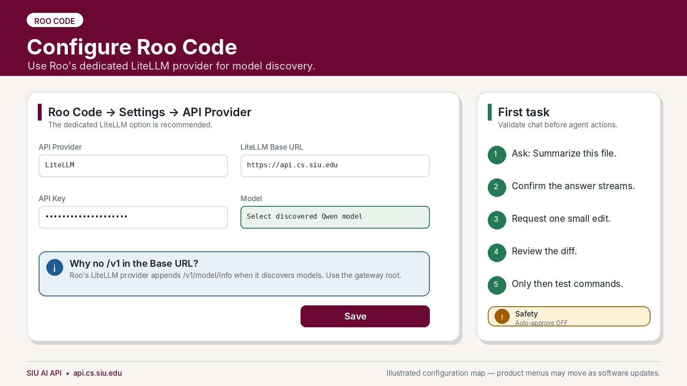

Roo Code has a dedicated **LiteLLM** provider. It can retrieve model information from the gateway and is the preferred first configuration.

### 15.1 Dedicated LiteLLM provider

Configure:

| Field | Value |
|---|---|
| API Provider | **LiteLLM** |
| LiteLLM Base URL | `https://api.cs.siu.edu` |
| API Key | Your assigned SIU AI key |
| Model | Select the discovered Qwen model |

Use the gateway root without `/v1` in this dedicated provider because Roo appends its LiteLLM model-information route. Verify that the discovered model reports a **Context Window** of `32768` and **Max Output Tokens** of `4096`. If either value is wrong, ask the administrator to correct `/v1/model/info` or use the fallback below.

### 15.2 Fallback when LiteLLM discovery is unavailable

Some gateways restrict `/v1/model/info`. If the dedicated provider cannot list models:

1. Select **OpenAI Compatible** instead.
2. Set Base URL to `https://api.cs.siu.edu/v1`.
3. Paste the assigned API key.
4. Enter the exact model ID manually.
5. Open **Model Configuration** and set **Context Window** to `32768` and **Max Output Tokens** to `4096`.

### 15.3 Safe first task

Ask Roo to summarize a file, confirm streaming works, request one small edit, review the diff, and only then test command execution. Keep auto-approve off.

A concise settings reference for Cline, Kilo, and Roo is included at [`examples/UI_SETTINGS_REFERENCE.md`](examples/UI_SETTINGS_REFERENCE.md).

---

<a id="16-troubleshooting"></a>

## 16. Troubleshooting

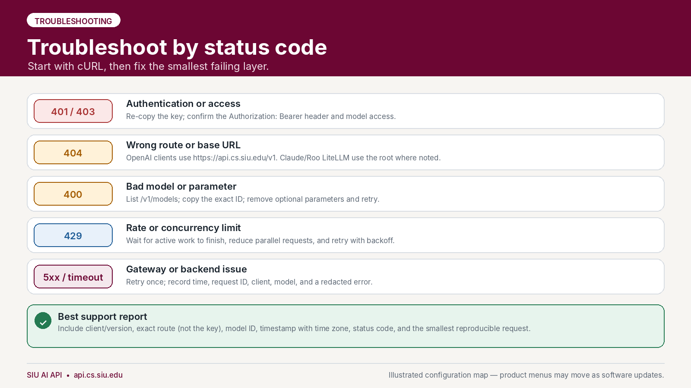

Always reproduce the problem with the cURL model-list or chat request first. This determines whether the failure belongs to the account/gateway or only to the client configuration.

### 401 or 403 — authentication or access

- Re-copy the key without spaces or surrounding quotation marks in a graphical client.
- Confirm the header is `Authorization: Bearer <key>`.
- Confirm the key has access to the selected model.
- Make sure the client is not sending an unrelated OpenAI, Anthropic, or saved subscription credential.
- Revoke and replace the key if it may have been exposed.

### 404 — wrong route or base URL

- OpenAI-compatible clients normally use `https://api.cs.siu.edu/v1`.
- Claude Code uses `https://api.cs.siu.edu` as `ANTHROPIC_BASE_URL`.
- Roo's dedicated LiteLLM provider uses the root URL; Roo's OpenAI-compatible fallback uses `/v1`.
- Do not paste the complete `/chat/completions` path into a field that expects only the base URL unless that client's documentation explicitly asks for it.

### 400 — bad model or unsupported parameter

- Run `GET /v1/models` again and copy the exact `id`.
- Remove optional parameters such as response formats, reasoning settings, image inputs, or vendor-specific options.
- Reduce the request to one user message and `temperature`.
- Confirm the JSON is valid.

### `fetch` is not defined when running JavaScript

The JavaScript example and its pinned OpenAI SDK require Node.js 22 or newer. Check with `node --version`. If the version is older than 22, upgrade Node.js, open a new terminal, then run `npm install` and `npm start` again. Activating or deactivating a Python virtual environment does not change the Node.js runtime.

### No matching distribution for `langchain-openai`

Run `python --version` inside the active virtual environment. LangChain 1.x requires Python 3.10 or newer. Installing a newer Python does not update an existing environment; deactivate the old environment and create a new one with the newer interpreter.

```bash
deactivate
python3.12 -m venv .venv312
source .venv312/bin/activate
python -m pip install --upgrade pip
python -m pip install -r requirements.txt
```

### 429 — rate, budget, or concurrency limit

- Wait for an active generation to finish.
- Avoid sending multiple simultaneous requests from the same key.
- Reduce automated retries and parallel agents.
- Retry with exponential backoff rather than an immediate loop.
- Contact the service administrator if a course workflow consistently needs a different limit.

### 5xx or timeout — gateway or model backend issue

- Retry once after a brief delay.
- Record the time with time zone, model ID, client, route, and redacted error.
- Do not repeatedly retry a large request.
- Test a tiny prompt with cURL.
- If cURL also fails, report the gateway issue rather than reinstalling the client.

### Chat works, but an agent cannot use tools

This usually indicates a tool-calling compatibility problem rather than an authentication problem. Record:

- Client and exact version
- Model ID
- Whether the tool call appeared as ordinary text, malformed JSON, or a native tool event
- Whether streaming was enabled
- The smallest prompt that reproduces the problem

Use chat-only or edit-only mode until the integration is validated.

### Support-report template

```text
Client and version:
Operating system:
Date/time and time zone:
Base URL or route used:
Model ID:
HTTP status code:
Did the cURL quick test work?:
Redacted error message:
Smallest reproducible prompt/request:
```

Never include the API key in a support report.

---

<a id="17-security-and-responsible-use"></a>

## 17. Security and responsible use

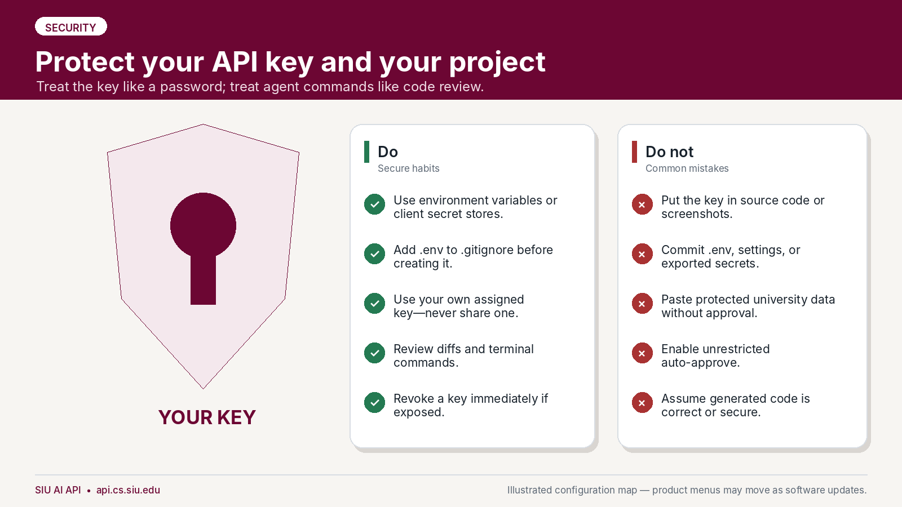

### API keys

- Use an environment variable, client credential store, or approved secret manager.
- Add `.env` to `.gitignore` before creating the file.
- Do not share a key with classmates, teammates, or instructors.
- Do not reuse one person's key for a class, lab, or public service.
- Revoke a key immediately after accidental exposure.

A useful `.gitignore` entry is:

```gitignore
.env
.env.*
!.env.example
```

### University and research data

Do not submit protected, regulated, confidential, export-controlled, student-record, health, personnel, credential, or other restricted information unless the data owner and applicable SIU policy explicitly permit that use. The fact that a service is university-hosted does not automatically authorize every category of data.

### Coding agents

Coding agents can modify files, run commands, install packages, access local configuration, and follow malicious instructions embedded in repository content. Use them as supervised assistants:

- Commit or back up clean work first.
- Read proposed changes.
- Review terminal commands before approval.
- Keep auto-approve off for consequential actions.
- Do not expose `.env`, SSH keys, browser profiles, cloud credentials, or production secrets.
- Run untrusted projects in an isolated environment.
- Test generated code and review it for security, licensing, correctness, and course requirements.

### Academic use

Follow the instructor's rules for each assignment. Preserve required citations and disclose AI assistance when the course policy requires it. An available API does not override academic-integrity expectations.

---

<a id="18-included-files"></a>

## 18. Included files

| Path | Purpose |
|---|---|
| [`examples/common/.env.example`](examples/common/.env.example) | Common endpoint, key, and model environment template |
| [`examples/curl/list-models.sh`](examples/curl/list-models.sh) | List the models available to a key |
| [`examples/curl/chat.sh`](examples/curl/chat.sh) | Send a non-streaming chat request |
| [`examples/python/quickstart.py`](examples/python/quickstart.py) | Python SDK request with error handling |
| [`examples/python/streaming.py`](examples/python/streaming.py) | Python streaming example |
| [`examples/javascript/quickstart.mjs`](examples/javascript/quickstart.mjs) | Node.js SDK request |
| [`examples/javascript/streaming.mjs`](examples/javascript/streaming.mjs) | Node.js streaming example |
| [`examples/continue/config.yaml`](examples/continue/config.yaml) | Continue local configuration |
| [`examples/continue/.env.example`](examples/continue/.env.example) | Continue secret-file template |
| [`examples/opencode/opencode.json`](examples/opencode/opencode.json) | OpenCode custom provider |
| [`examples/aider/.aider.conf.yml`](examples/aider/.aider.conf.yml) | Aider endpoint and model configuration |
| [`examples/aider/.aider.model.metadata.json`](examples/aider/.aider.model.metadata.json) | Aider context and output-limit metadata |
| [`examples/aider/.env.example`](examples/aider/.env.example) | Aider secret template |
| [`examples/postman/SIU_AI_API.postman_collection.json`](examples/postman/SIU_AI_API.postman_collection.json) | Postman collection |
| [`examples/postman/SIU_AI_Local.postman_environment.json`](examples/postman/SIU_AI_Local.postman_environment.json) | Postman environment template |
| [`examples/langchain/quickstart.py`](examples/langchain/quickstart.py) | LangChain example |
| [`examples/langchain/langgraph_example.py`](examples/langchain/langgraph_example.py) | Minimal LangGraph example |
| [`examples/claude-code/start-claude-code.sh`](examples/claude-code/start-claude-code.sh) | Advanced Claude Code launcher |
| [`examples/claude-code/start-claude-code.ps1`](examples/claude-code/start-claude-code.ps1) | Windows PowerShell Claude Code launcher |
| [`examples/claude-code/settings.json.example`](examples/claude-code/settings.json.example) | Claude Code gateway settings without a key |
| [`examples/codex/config.toml`](examples/codex/config.toml) | Advanced Codex custom provider |
| [`examples/UI_SETTINGS_REFERENCE.md`](examples/UI_SETTINGS_REFERENCE.md) | One-page settings reference for UI clients |
| [`ADMIN_PUBLISHING_CHECKLIST.md`](ADMIN_PUBLISHING_CHECKLIST.md) | Pre-publication validation for administrators |
| [`MANIFEST.json`](MANIFEST.json) | Machine-readable package inventory and hashes |
| [`CHECKSUMS.txt`](CHECKSUMS.txt) | SHA-256 checksums for package files |

---

## Official documentation references

These links were used to validate the configuration patterns in this guide. Third-party products change; consult their current documentation if a menu or option has moved.

- [LiteLLM — OpenAI-compatible proxy examples](https://docs.litellm.ai/docs/proxy/user_keys)
- [Continue — OpenAI model-provider configuration](https://docs.continue.dev/customize/model-providers/top-level/openai)
- [Cline — OpenAI Compatible provider](https://docs.cline.bot/provider-config/openai-compatible)
- [OpenCode — providers and custom providers](https://opencode.ai/docs/providers/)
- [Aider — OpenAI-compatible APIs](https://aider.chat/docs/llms/openai-compat.html)
- [Postman — import data](https://learning.postman.com/docs/getting-started/importing-and-exporting/importing-data)
- [LangChain — OpenAI-compatible endpoints](https://docs.langchain.com/oss/python/concepts/providers-and-models)
- [LiteLLM — Claude Code with non-Anthropic models](https://docs.litellm.ai/docs/tutorials/claude_non_anthropic_models)
- [Anthropic — Claude Code LLM gateways](https://docs.anthropic.com/en/docs/claude-code/llm-gateway)
- [OpenAI — Codex configuration basics](https://developers.openai.com/codex/config-file/config-basic)
- [Kilo Code — OpenAI-compatible providers](https://kilo.ai/docs/ai-providers/openai-compatible)
- [Roo Code — LiteLLM provider](https://docs.roocode.com/providers/litellm)
